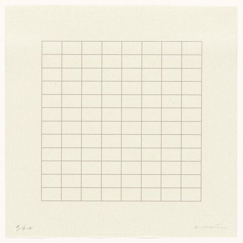
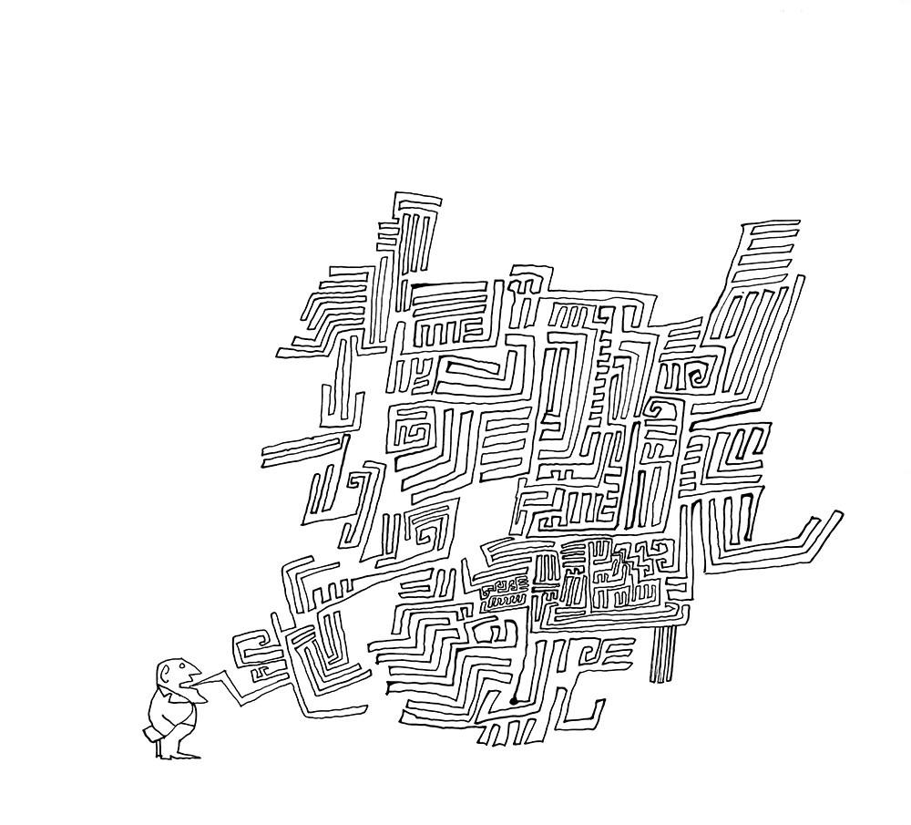
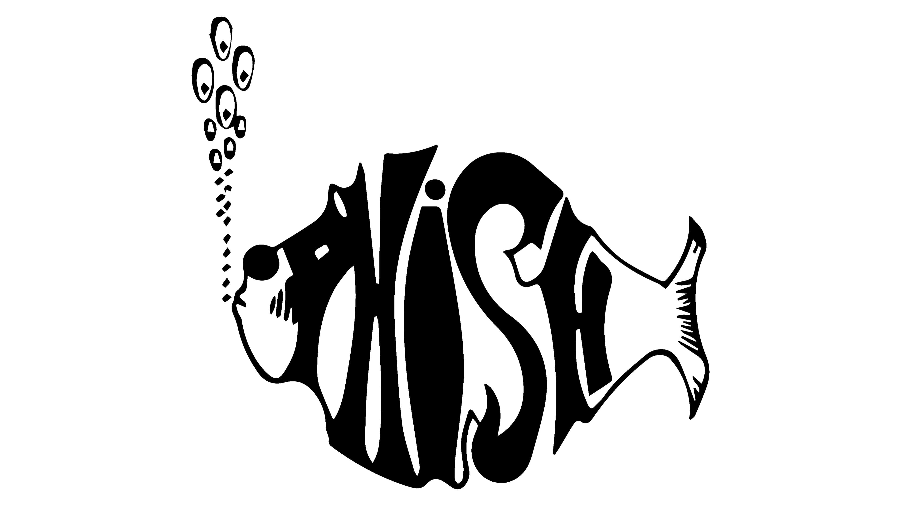

<!-- Edit your panel content directly in the HTML below. You can use text and  tags. -->

```{r read-data,echo=FALSE,results="hide",warning=FALSE,message=FALSE}
clean_path <- file.path("~/Library/CloudStorage/Box-Box/clients/law_firms/phelps/clean_data/")

model_df <- read.csv(file.path(clean_path, "client_industry_monthly_2020_2025_with_predictors.csv"), 
                     stringsAsFactors=FALSE)
```

```{=html}
<div id="sheet">
  <div class="inner">
    <!-- Top row (rotated 180°): [Page 8] [Page 1] [Page 2] [Page 3] -->

    <div class="cell rotated">
      <div class="panel">
        <h3>GRID Magazine<br>Grooves, Research, Ideas, Data</h3>
        <div class="body">&copy; 2025 GRID Magazine</div>
      </div>
    </div>

    <div class="cell rotated">
      <div class="panel">
        <h3>GRID Magazine<br>Issue 1</h3>
        <div class="body"><br></div>
        <div class="body"><br>Agnes Martin, Untitled, 1973</div>

      </div>
    </div>

    <div class="cell rotated">
      <div class="panel">
        <h3>What is GRID Magazine?<br>The Light That Shines</h3>
        <div class="body"><br></div>
        <div class="body"><strong>GRID </strong> is grooves, research, ideas, data<br>
        <strong>GRID </strong>is the anti-dystopian's favorite rag<br><strong>GRID </strong>helps navigate a complex modern existence<br><strong>GRID </strong> shares everyday experiences, like great music, to build optimism about the good in the world, and grace in our daily lives</div>
        </div>
        </div>

    <div class="cell rotated">
      <div class="panel">
        <h3>10 Triumphant Songs</h3>
        <div class="body">Music lets us feel what we might otherwise repress. An oppressive world still delivers emphatic music. These 10 triumphant songs get us through our days with their deep emotion and explosive grooves. Some, like Galaxy Band, smack you over the head instantly. Others, like Isaac Hayes's masterful cover, burn slow for minutes (and minutes) before the horns announce themselves <br><br><br><br> <div class="body" style="text-align:center;">
  &#x1FAA9;  &#x1FAA9;  &#x1FAA9; <strong>HANDS RAISED</strong> &#x1FAA9;  &#x1FAA9;  &#x1FAA9; <br><br>
</div> 
        <ol>
        <li>Kano&mdash;Another Life</li>
        <li>Galaxy Band&mdash;Gosh</li>
        <li>Solange&mdash;Losing You</li>
        <li>John David&mdash;On The Mountain &#9968;</li>
        <li>Bob Dylan&mdash;No Time To Think</li>
        <li>Josette Martial&mdash;Let's Be Winners</li>
        <li>The Ray and and John&mdash;Day By Day</li>
        <li>Jerry Garcia Band&mdash;Rubin and Cherise</li>
        <li>Phish&mdash;What's Going Through Your Mind</li>
        <li>Isaac Hayes&mdash;By The Time I Get To Phoenix</li>
      </ol></div>
      </div>
    </div>

    <!-- Bottom row (upright): [Page 4] [Page 5] [Page 6] [Page 7] -->
    <div class="cell">
      <div class="panel">
        <h3>How Many Times Does Trey Say "Mind"?</h3>
        <div class="body"><br></div>
        <br>
        <br>
        <br>
        <div class="body">Phish's "What's Going Through Your Mind," which starts with a guitar vamp echoing James Gang's "Walkaway" crunch, includes the chorus: <br><br>To the years we've suffered most<br>From things we've never spoken<br>Still I think you know<br>If looks could kill, we'd both be broken<br>Though after all this time it seems<br>We're not each other's kind<br>Never think that I don't know<br>What's going through your mind<br><br>The word "mind" is repeated 28 times with each chorus, and more once the jam takes flight. In the December 31, 2024 version we count XX total "mind"s </div>
      </div>
    </div>

    <div class="cell">
      <div class="panel">
        <h3>What's Going Through Your Mind</h3>
        <h1>mind mind mind mind mind mind mind mind mind mind mind mind mind mind mind mind mind mind mind mind mind mind mind mind mind mind mind mind mind mind mind mind mind mind mind mind mind mind mind mind mind mind mind mind mind mind mind mind mind mind mind mind mind mind mind mind </h1>
      </div>
    </div>

    <div class="cell">
      <div class="panel">
        <h3>Page 6</h3>
        <div class="body">`r model_df$parker_industry[1]`</div>
      </div>
    </div>

    <div class="cell">
      <div class="panel">
        <h3>Page 7</h3>
        <div class="body">Body text</div>
      </div>
    </div>
  </div>
</div>

```
