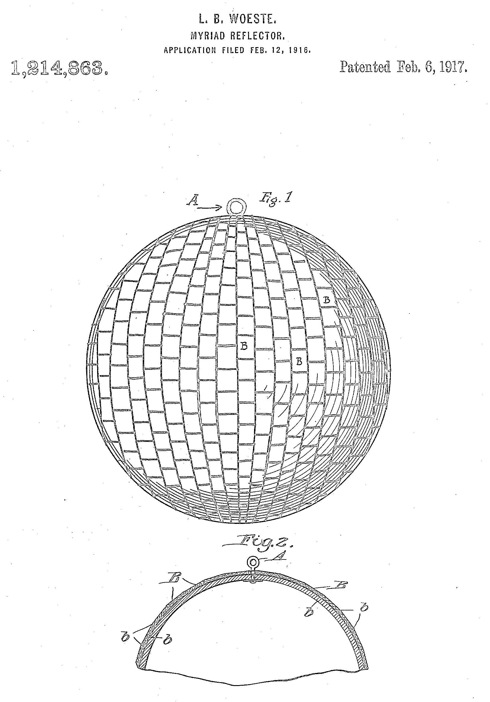

<!-- Edit your panel content directly in the HTML below. You can use text and  tags. -->


```{=html}
<div id="sheet">
  <div class="inner">
    <!-- Top row (rotated 180°): [Page 8] [Page 1] [Page 2] [Page 3] -->

    <div class="cell rotated">
      <div class="panel">
        <h3>Grooves<br>Research<br>Ideas<br>Data</h3>
        <div class="body">&copy; 2025 GRID Magazine</div>
      </div>
    </div>

    <div class="cell rotated">
      <div class="panel">
        <h3>GRID Magazine<br>Issue 1</h3>

        <div class="body"><br>Agnes Martin, Untitled, 1973</div>

      </div>
    </div>

    <div class="cell rotated">
      <div class="panel">
        <h3>GRID Magazine</h3>
        <h1>The Light That Shines</h1>
        <div class="body"><br></div>
        <div class="body"><strong>GRID </strong> is grooves, research, ideas, data<br>
        <strong>GRID </strong>is the anti-dystopian's favorite rag<br><strong>GRID </strong>to navigate our complex modern existence<br><strong>GRID </strong> to grow your optimism and sense of grace</div>
        </div>
        </div>

    <div class="cell rotated">
      <div class="panel">
        <h3>10 Triumphant Songs</h3>
        <div class="body">Oppressive worlds inspire triumphant sounds. These 10 songs get us through our days with deep emotion and explosive grooves. Some songs smack instantly, like Galaxy Band. Others burn slow for minutes, and minutes, like Isaac Hayes's masterful cover of Jimmy Webb's song popularized by the Rhinestone Cowboy, Glenn Campbell<br><br><br><br> <div class="body" style="text-align:center;">
  &#x1FAA9;  &#x1FAA9;  &#x1FAA9; <strong>HANDS RAISED</strong> &#x1FAA9;  &#x1FAA9;  &#x1FAA9; <br><br>
</div> 
        <ol>
        <li>Reggio&mdash;The Light</li>
        <li>Galaxy Band&mdash;Gosh</li>
        <li>Solange&mdash;Losing You</li>
        <li>Bob Dylan&mdash;No Time To Think</li>
        <li>John David&mdash;On The Mountain &#9968;</li>
        <li>Josette Martial&mdash;Let's Be Winners</li>
        <li>The Temper Trap&mdash;Sweet Disposition</li>
        <li>Jerry Garcia Band&mdash;Rubin and Cherise</li>
        <li>Phish&mdash;What's Going Through Your Mind</li>
        <li>Isaac Hayes&mdash;By The Time I Get To Phoenix (18-minute version)</li>
      </ol></div>
      </div>
    </div>

    <!-- Bottom row (upright): [Page 4] [Page 5] [Page 6] [Page 7] -->
    <div class="cell">
      <div class="panel">
        <h3>How Many Times Did Trey Say "Mind"?</h3>
        <div class="body"></div>
        <br>
        <div class="body">Phish's "What's Going Through Your Mind" begins as guitarist Trey Anastasio vamps with a James Gang "Walkaway" crunch. A mesmerizing chorus sings: <br><br>To the years we've suffered most<br>From things we've never spoken<br>Still I think you know<br>If looks could kill, we'd both be broken<br>Though after all this time it seems<br>We're not each other's kind<br>Never think that I don't know<br>What's going through your mind<br><br>The word "mind" repeats 28x per chorus. We count 122 "mind"s in 12/31/2024's techno epic</div>
      </div>
    </div>

    <div class="cell">
      <div class="panel">
        <h3>What's Going Through Your Mind</h3>
        <h1>mind mind mind mind mind mind mind mind mind mind mind mind mind mind mind mind mind mind mind mind mind mind mind mind mind mind mind mind mind mind mind mind mind mind mind mind mind mind mind mind mind mind mind mind mind mind mind mind mind mind mind mind mind mind mind mind mind mind mind mind </h1>
      </div>
    </div>

    <div class="cell">
      <div class="panel">
        <h3>Inventing the Disco Ball</h3>
        <div class="body">The patent application for the disco ball, or "myriad reflector," was filed in 1916 by Louis Bernard Woeste of Kentucky. Woeste wrote his invention's aim is "to produce a myriad reflector reflecting surfaces, the same to be arranged in such a manner that the several reflections shall be projected at varying angles, the device itself being arranged so that it may be rotated or otherwise moved so that the reflections may [produce a] spectacular effect." The illustration accompanying Woeste's application is below. Next time you find yourself mesmerized by a disco ball, thank Louis Bernard Woeste's spectacular aesthetic</div>
        <div class="body"><br></div>
        </div>
        </div>

    <div class="cell">
      <div class="panel">
        <h3></h3>
        <div class="body">Body text</div>
      </div>
    </div>
  </div>
</div>

```
